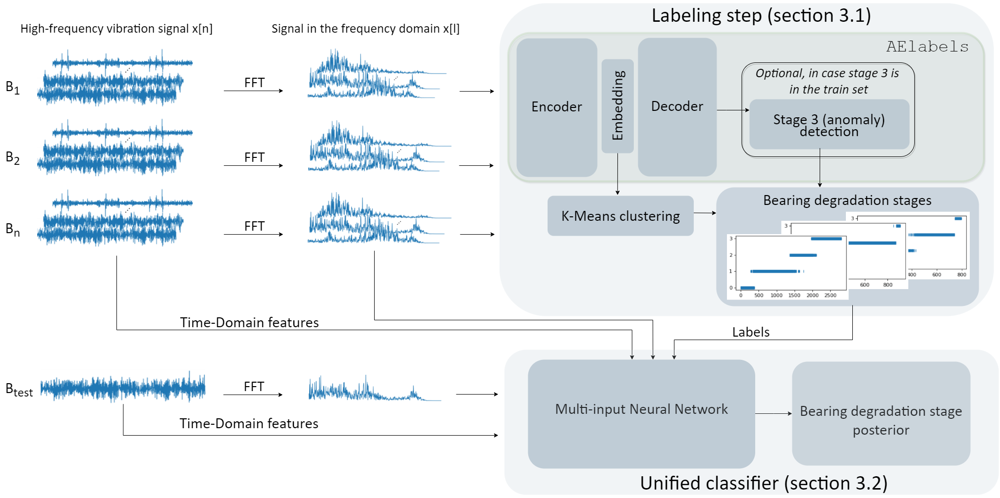

# A Framework for Predicting the Degradation Stages of Rolling-Element Bearings

# Method

This bearing degradation stage detection method consists of two parts as shown in the chart below: 

* Domain knowledge based bearing vibration data labeling (Labeling step)
* Classifier trained with this labeled bearing vibration data for bearing degradation stage prediction (Unified classifier)

## Part 1 - Data labeling

<!---
### Project Structure
The project is structured as shown in the flowchart. 

* Dataset collection/creation:
The different datasets are collected (and created) using the data_import.py and 
ImageNet_subset_creator.py files in the io-folder. Specific paths to the different datasets are to be set in the
data_paths.py file. The PCam-dataset is first converted to PNG-files and stored in the home directory using the
pcam_converter.py file. The PNG-images are collected using the data_import.py file. 

* Pretraining:
In the transfer_experiments.py file the pretraining experiment is created and connected with Sacred. In the models 
folder the model_preparation_saving.py and tf_generators_models_kfold.py files include functions that create the 
necessary model, generators, etc. After pretraining the trained model is stored on OSF using the requests_OSF.py file. 
The experiment results are logged into Neptune using Sacred. 

* Transfer learning and evaluation:
The pretrained models are used in the transfer learning experiments, created in the transfer_experiments.py file. 
Similarly to pretraining, models, generators etc. are created using the model_preparation_saving.py and 
tf_generators_models_kfold.py files. The transfer performance is evaluated using the AUC_evaluation.py file in the
evaluation folder. The resulting models, weights and predictions are stored on OSF with the 
requests_OSF.py file. The experiment results are logged into Neptune using Sacred. 
Figures included in the paper are created using the visualization functions in the AUC_evaluation.py file. Note that 
for this the trained models need to be in the home directory.

Extra: 
Feature maps of the models can be created using the featuremaps_viz.py file, plots showing the stability during 
training/validation/testing can be created using the stability_plot.py file. 
-->

## Part 2 - Bearing degradation stage classification

### Built with

* Pandas 
* NumPy 
* SciPy
* Scikit-learn 
* Keras

### Prerequisites

The packages needed to run the project are listed in the requirements.txt file.

The dataset used in the project need to be downloaded from https://ti.arc.nasa.gov/tech/dash/groups/pcoe/prognostic-data-repository/#femto, and stored in the data directory.
